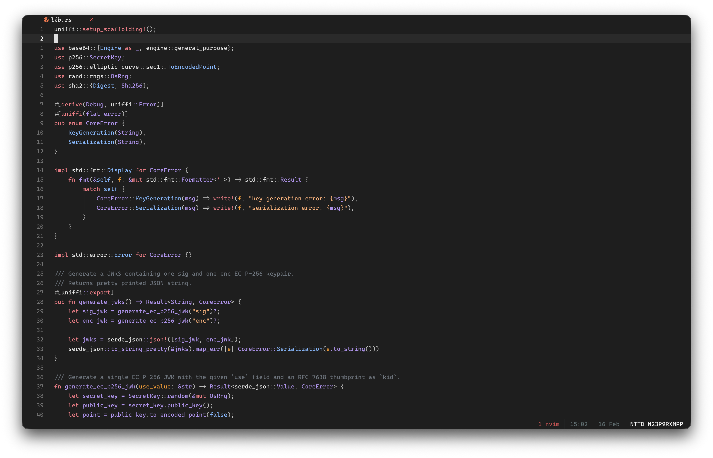

# min-theme.nvim

A Neovim dark colorscheme inspired by min-theme

## Screenshot



## Features

- Dark-only theme
- Tree-sitter and LSP-friendly highlight groups
- Plugin integrations for common UI/tooling plugins
- Configurable highlight overrides

## Installation

### lazy.nvim

```lua
{
  "flaviodelgrosso/min-theme.nvim",
  lazy = false,
  priority = 1000,
  config = function()
    vim.cmd.colorscheme("min-theme")
  end,
}
```

## Configuration

```lua
require("min-theme").setup({
  terminal_colors = true,
  undercurl = true,
  underline = true,
  bold = true,
  italic = {
    strings = true,
    emphasis = true,
    comments = true,
    operators = false,
    folds = true,
  },
  strikethrough = true,
  invert_selection = false,
  invert_signs = false,
  invert_tabline = false,
  inverse = true,
  contrast = "", -- "", "soft", "hard"
  overrides = {},
  dim_inactive = false,
  transparent_mode = false,
})

vim.cmd.colorscheme("min-theme")
```

## Config Details

- `terminal_colors`: set terminal ANSI colors (`vim.g.terminal_color_*`)
- `contrast`: controls base surface/diff intensity (`""`, `"soft"`, `"hard"`)
- `transparent_mode`: removes background from main editor surfaces
- `dim_inactive`: dims inactive windows
- `overrides`: override any highlight group directly

## Examples

### Hard contrast

```lua
require("min-theme").setup({
  contrast = "hard",
})
vim.cmd.colorscheme("min-theme")
```

### Transparent background

```lua
require("min-theme").setup({
  transparent_mode = true,
})
vim.cmd.colorscheme("min-theme")
```

### Highlight override

```lua
require("min-theme").setup({
  overrides = {
    Comment = { italic = false },
    NormalFloat = { bg = "#1c1c1c" },
    CursorLine = { bg = "#202020" },
  },
})
vim.cmd.colorscheme("min-theme")
```

## Requirements

- Neovim `>= 0.8`

## License

MIT. See `LICENSE`.
